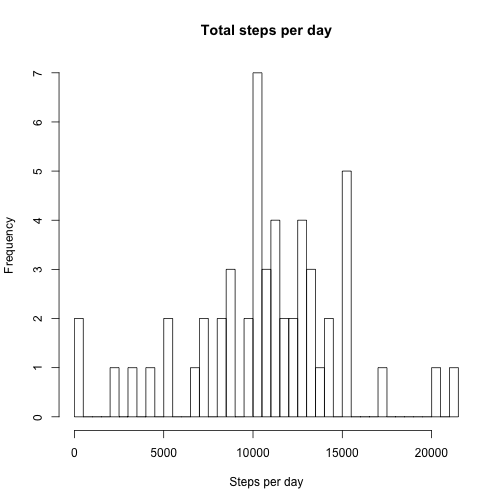
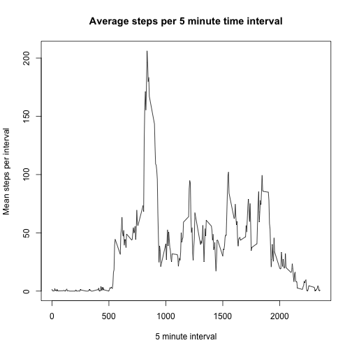
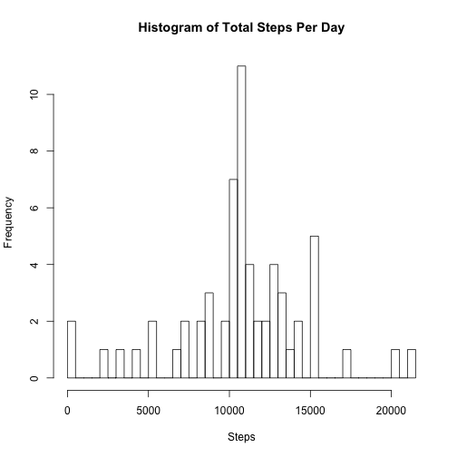
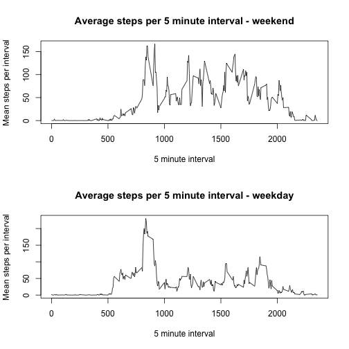

# Reproducible Research: Peer Assessment 1


## Loading and preprocessing the data

```r
activity <- read.csv("activity.csv", header = TRUE)
str(activity)
```

```
## 'data.frame':	17568 obs. of  3 variables:
##  $ steps   : int  NA NA NA NA NA NA NA NA NA NA ...
##  $ date    : Factor w/ 61 levels "2012-10-01","2012-10-02",..: 1 1 1 1 1 1 1 1 1 1 ...
##  $ interval: int  0 5 10 15 20 25 30 35 40 45 ...
```

```r
head(activity)
```

```
##   steps       date interval
## 1    NA 2012-10-01        0
## 2    NA 2012-10-01        5
## 3    NA 2012-10-01       10
## 4    NA 2012-10-01       15
## 5    NA 2012-10-01       20
## 6    NA 2012-10-01       25
```


## What is mean total number of steps taken per day?

```r
total_steps_per_day <- tapply(activity$steps, activity$date, sum)
hist(total_steps_per_day, breaks = 50, xlab = "Steps per day", main = "Total steps per day")
```

 

```r
# interestingly, the mean and median computed by summary() are different
# from those computed by mean() and median()!
summary(total_steps_per_day)
```

```
##    Min. 1st Qu.  Median    Mean 3rd Qu.    Max.    NA's 
##      41    8840   10800   10800   13300   21200       8
```

```r
mean(total_steps_per_day, na.rm = T)
```

```
## [1] 10766
```

```r
median(total_steps_per_day, na.rm = T)
```

```
## [1] 10765
```


## What is the average daily activity pattern?
Plot the 5-minute intervals vs the mean steps taken per interval.

```r
interval_groups <- split(activity, activity$interval)
mean_steps_per_interval <- sapply(interval_groups, function(x) {
    mean(x$steps, na.rm = T)
})
plot(names(mean_steps_per_interval), mean_steps_per_interval, type = "l", main = "Average steps per 5 minute time interval", 
    xlab = "5 minute interval", ylab = "Mean steps per interval")
```

 


Determine which 5-minute interval contains the maximum number of steps.

```r
total_steps_per_interval <- sapply(interval_groups, function(x) {
    sum(x$steps, na.rm = T)
})
which.max(total_steps_per_interval)
```

```
## 835 
## 104
```

```r
# the 835 interval contains the max number of steps; 104 is just the index
# of the 835 entry in the vector
```


## Imputing missing values
The total number of missing values in the dataset:

```r
num_missing_values <- dim(activity)[1] - sum(complete.cases(activity))
num_missing_values
```

```
## [1] 2304
```


Impute missing values using the mean for the 5-minute interval in question.  And
create a new instance of the dataset containing the imputed data.

```r
good <- complete.cases(activity)
get_interval_mean <- function(interval) {
    interval_ch <- as.character(interval)
    idx <- which(names(mean_steps_per_interval) == interval_ch)
    mean_steps_per_interval[idx]
}
activity2 <- activity
activity2$steps[!good] <- sapply(activity2$interval[!good], FUN = get_interval_mean)
# verify the missing values are all gone
num_missing_values2 <- dim(activity2)[1] - sum(complete.cases(activity2))
num_missing_values2
```

```
## [1] 0
```


Histogram, mean and median of total steps per day.

```r
total_steps_per_day2 <- tapply(activity2$steps, activity$date, sum)
hist(total_steps_per_day2, breaks = 50, main = "Histogram of Total Steps Per Day", 
    xlab = "Steps")
```

 

```r
summary(total_steps_per_day2)
```

```
##    Min. 1st Qu.  Median    Mean 3rd Qu.    Max. 
##      41    9820   10800   10800   12800   21200
```

```r
mean(total_steps_per_day2, na.rm = T)
```

```
## [1] 10766
```

```r
median(total_steps_per_day2, na.rm = T)
```

```
## [1] 10766
```


## Are there differences in activity patterns between weekdays and weekends?

Create a new factor variable indicating the type of day: weekday or weekend

```r
day_of_week <- weekdays(as.Date(activity2$date))
get_day_type <- function(x) {
    if (x %in% c("Saturday", "Sunday")) 
        return("weekend") else return("weekday")
}
day_type <- sapply(day_of_week, get_day_type)
day_type <- as.factor(day_type)
table(day_type)
```

```
## day_type
## weekday weekend 
##   12960    4608
```


Plot the 5-minute intervals vs mean steps taken per interval for each of the two day type groups: weekday and weekend

```r
day_type_group <- split(activity2, day_type)
interval_groups <- split(day_type_group$weekday, day_type_group$weekday$interval)
mean_steps_per_interval_weekday <- sapply(interval_groups, function(x) {
    mean(x$steps, na.rm = T)
})
interval_groups <- split(day_type_group$weekend, day_type_group$weekend$interval)
mean_steps_per_interval_weekend <- sapply(interval_groups, function(x) {
    mean(x$steps, na.rm = T)
})

par(mfrow = c(2, 1))
plot(names(mean_steps_per_interval_weekend), mean_steps_per_interval_weekend, 
    type = "l", main = "Average steps per 5 minute interval - weekend", xlab = "5 minute interval", 
    ylab = "Mean steps per interval")
plot(names(mean_steps_per_interval_weekday), mean_steps_per_interval_weekday, 
    type = "l", main = "Average steps per 5 minute interval - weekday", xlab = "5 minute interval", 
    ylab = "Mean steps per interval")
```

 

```r
par(mfrow = c(1, 1))
```


